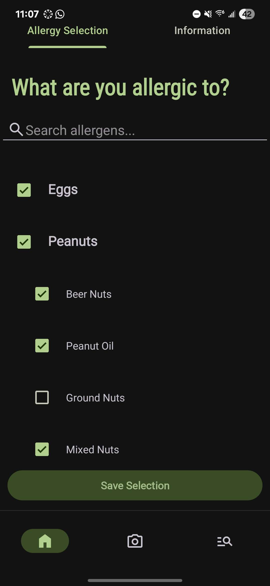
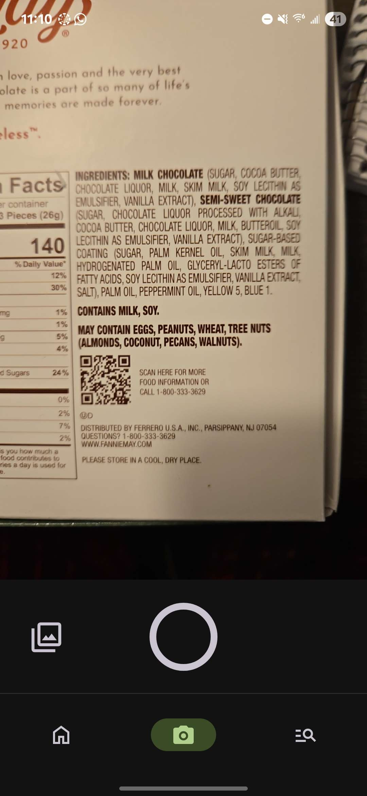
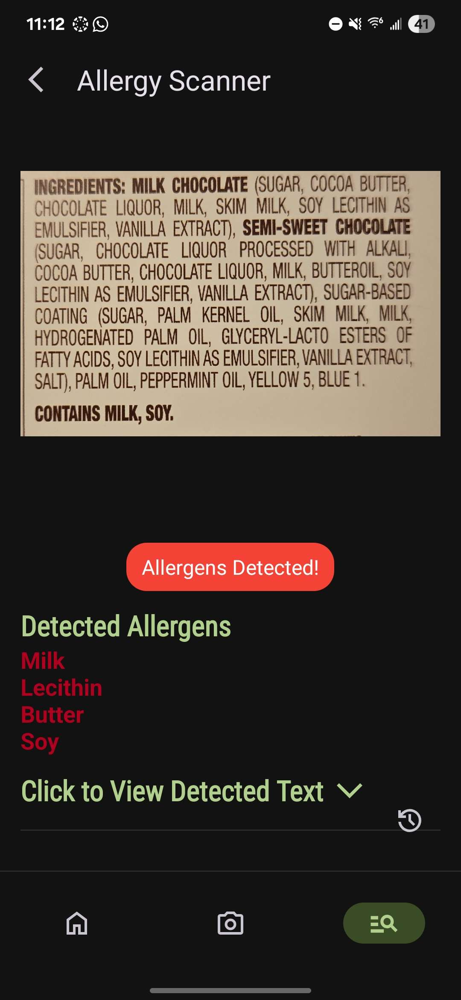

AllergyScanner is an Android mobile application that helps users identify food allergens in product ingredient lists using image scanning and customizable allergen preferences. Designed with accessibility and ease of use in mind, this app empowers individuals with food allergies to make informed decisions and stay safe.

---

## 📱 Features

- ✅ Select from a comprehensive list of common allergens  
- ✅ Add custom allergens not found in predefined categories  
- ✅ Persistent allergen selection using SharedPreferences  
- ✅ Scan product labels using the device camera  
- ✅ Optical Character Recognition (OCR) powered by EasyOCR  
- ✅ Tabbed interface with allergy selection, camera, and results views  
- ✅ Bottom navigation for quick access between major app sections  

---

## 🏗️ Architecture

This project follows the **Model-View-Controller (MVC)** architecture:

- **Model**: Data classes for `AllergenCategory` and `AllergenItem`
- **View**: UI components built with Activities, Fragments, and XML layouts
- **Controller**: Logic in Fragments and Adapters that handles user interaction and updates views accordingly

---

## 📸 Screenshots
| Allergen Selection| Camera View| Scan Results|
|:-:|:-:|:-:|

---

## 🛠️ Tech Stack

- Kotlin  
- Android SDK  
- ViewPager2 + TabLayout  
- ExpandableListView  
- SharedPreferences  
- EasyOCR (OCR model)  
- Material Design Components  

---

## 📦 Installation

1. Clone the repository: git clone https://github.com/your-username/AllergyScanner.git
  
2. Open the project in **Android Studio**

3. Sync Gradle and run on an emulator or physical Android device (API 26+ recommended)

---

## 🔭 Future Improvements

- 📦 Add support for barcode scanning  
- 🧠 Migrate to MVVM architecture with ViewModel and LiveData  
- 🗃️ Implement Room database for storing scan history  
- 📤 Enable export/sharing of results  
- 👨‍👩‍👧 Support multi-user profiles (e.g., families, classrooms)  

---

## 👥 Authors

- [Bryce Walker](http://www.linkedin.com/in/brycewalker-bw)
- [Josue Navarete](www.linkedin.com/in/josue-navarrete-jbn)
- [Lucas Brikenstock](https://www.linkedin.com/in/lucas-birkenstock/)
- [Armando Landeros](http://linkedin.com/in/armando-landeros-40ab1b277)

---

## 📄 License

This project is for educational purposes only. No commercial use is intended.

